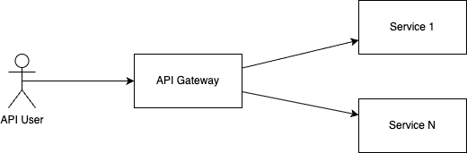

# API Gateway

## Description

Base gateway for all microservices. It is a Spring Cloud Gateway that routes requests to the appropriate microservice. It is responsible for authentication, authorization, and rate limiting.

## Research

<!-- Research content or related articles and documentation -->

For the purpsose of testing and studying Spring Cloud and related frameworks, the Spring Cloud API gateway was picked in an attempt to create a hybrid architecture.

## Design

<!-- Design content or related documentation -->

The API Gateway is a Spring Cloud Gateway that routes requests to the appropriate microservice. It is responsible for authentication, authorization, and rate limiting.

The configuration should consider two different modes:

- `Development`: simplified configuration for local development
- `Production`: production-ready configuration with security and rate limiting

## Tech Stack

<!-- list of technologies used -->

- Spring Cloud - API Gateway handling all requests

### Proposal

<!-- Proposal content -->

Uses `Spring Cloud API Gateway` as main entrypoint for all API calls

- **To be discussed**: Is it suitable to do intra-service communication through the API Gateway?

### Implementation

Tasks:

- [ ] Bootstrap basic gateway
- [ ] Add routing to the gateway
- [ ] Add basic authentication and authorization (to be replaced later)
- [ ] Add rate limiting
- [ ] Setup prometheus metrics

#### 1. Setup

 Using [`Spring intializr`](https://start.spring.io/) created a project with the following parameters:

 - Project: Maven
 - Language: Java
 - Spring Boot: 3.4.2
 - Project Metadata:
   - Group: `ms.danielfbm.github.io`
   - Artifact: `api-gateway`
   - Name: `api-gateway`
   - Description: `API Gateway for all microservices`
   - Package Name: `ms.danielfbm.github.io.api-gateway`
   - Packaging: `Jar`
   - Java: `23`
 - Dependencies:
   - Sprint Cloud Gateway
   - Spring Boot Actuator

## Impact

<!-- Impact of this feature in the project -->
- May create conflicting impact with other services that are not spring boot based
- May require additional configuration to work with other services
- May not support gRPC services

## Testing

<!-- How test should be implemented to ensure quality of the feature -->

Spring Cloud features a testing module that can be used to test the gateway. It is recommended to write tests for the gateway to ensure that it is working as expected.

## Security

<!-- Security impact and measures taken to improve or mitigate security issues -->

API Gateway already features security measures such as rate limiting and authentication and is imperavite to use these features to ensure that the gateway is secure.

## Considerations for future development

- Find other API Gateway solutions for hybrid architectures that are not Spring Cloud based, and may be a drop-in replacement for the Spring Cloud Gateway

## References

<!-- Any relevant articles, books, or links -->

- [Getting started with Spring Cloud Gateway](https://spring.io/blog/2019/06/18/getting-started-with-spring-cloud-gateway)
- [Spring Cloud Gateway Documentation](https://spring.io/projects/spring-cloud)